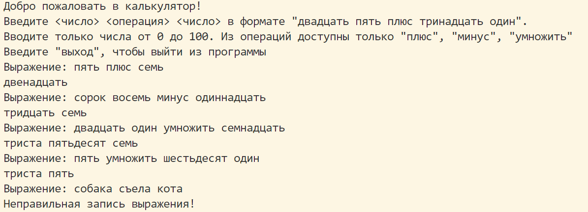
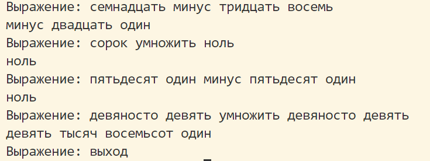

# Отчёт о проделанной работе
## 1. Практикума по программированию - "Калькулятор"
## 2. Студент - Горинов Павел Алексеевич, ТРПО24-2
## 3. Базовая часть:
## Написать калькулятор для строковых выражений вида '<число> <операция> <число>', где <число> - не отрицательное целое число меньшее 100, записанное словами, например "тридцать четыре", <арифмитическая операция> - одна из операций "плюс", "минус", "умножить". Результат выполнения операции вернуть в виде текстового представления числа. Пример calc("двадцать пять плюс тринадцать") -> "тридцать восемь"
## Оформить калькулятор в виде функции, которая принимает на вход строку и возвращает строку.

## Дополнительные задания:
### Баллы 3
3) Реализовать текстовый калькулятор для выражения из произвольного количества операций с учетом приоритета операций. Пример: calc("пять плюс два умножить на три минус один") -> "десять". (Для реализации рекомендуется использовать алгоритмы основанные на польской инверсной записи см. например, https://ru.wikipedia.org/wiki/%D0%9E%D0%B1%D1%80%D0%B0%D1%82%D0%BD%D0%B0%D1%8F_%D0%BF%D0%BE%D0%BB%D1%8C%D1%81%D0%BA%D0%B0%D1%8F_%D0%B7%D0%B0%D0%BF%D0%B8%D1%81%D1%8C ) 

### Баллы 2
10) Диагностировать ошибки: неправильную запись числа; неправильную последовательность чисел и операций; (задание 1) деление на ноль; (задание 3) неправильную последовательность чисел и операций; (задание 4) некорректный баланс и вложенность скобок; (задание 6) некорректную запись числа

## Проверка работоспособности:

